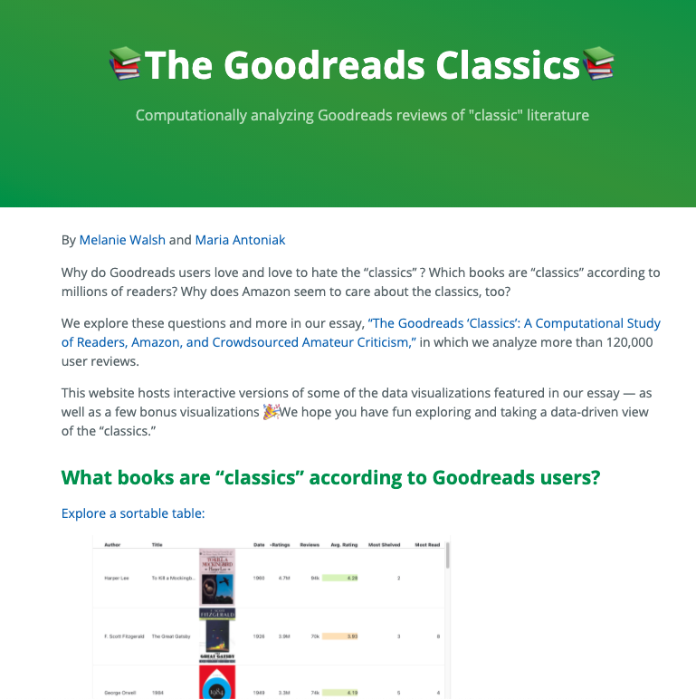

# The Goodreads Classics

Website: https://melaniewalsh.github.io/Goodreads-Classics/

This repository hosts the code behind Melanie Walsh and Maria Antoniak's Goodreads Classics website and interactive plots. The website is a companion to our 2021 article, ["The Goodreads ‘Classics’: A Computational Study of Readers, Amazon, and Crowdsourced Amateur Criticism"](https://post45.org/2021/04/the-goodreads-classics-a-computational-study-of-readers-amazon-and-crowdsourced-amateur-criticism/).

You can find the code for our Goodreads Scraper in a [separate GitHub repository](https://github.com/maria-antoniak/goodreads-scraper), and you can find the metadata and code behind our article in the [Cultural Analytics Dataverse](https://dataverse.harvard.edu/dataset.xhtml?persistentId=doi:10.7910/DVN/GJYYKE).

