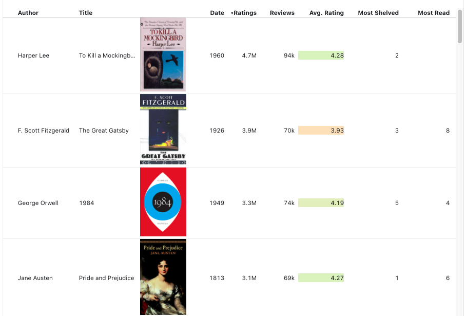
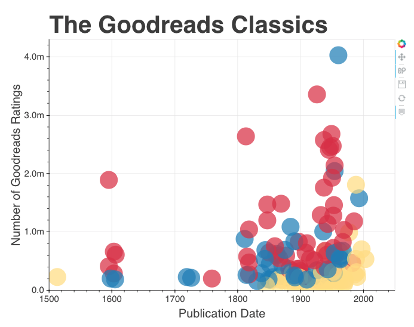
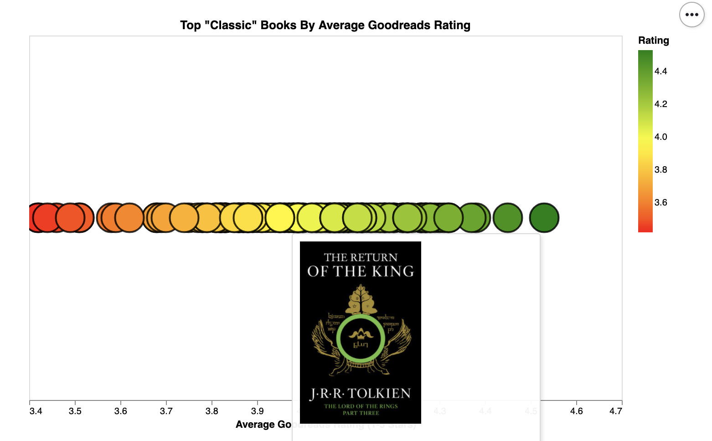
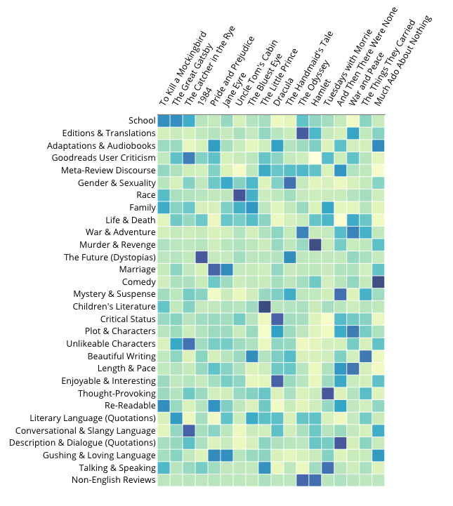

By [Melanie Walsh](https://melaniewalsh.org/) and [Maria Antoniak](https://maria-antoniak.github.io/)

Why do Goodreads users love and love to hate the "classics" ? Which books are "classics" according to millions of readers? Why does Amazon seem to care about the classics, too?

We explore these questions and more in our essay, ["The Goodreads 'Classics': A Computational Study of Readers, Amazon, and Crowdsourced Amateur Criticism,"](https://post45.org/2021/04/the-goodreads-classics-a-computational-study-of-readers-amazon-and-crowdsourced-amateur-criticism/) in which we analyze more than 120,000 user reviews.

This website hosts interactive versions of some of the data visualizations featured in our essay — as well as a few bonus visualizations 🎉 We hope you have fun exploring and taking a data-driven view of the "classics."

## **What books are "classics" according to Goodreads users?**
<a href="Goodreads-Classics-Table.html"> Explore a sortable table: </a> 
<figure>

</figure>

<figure>

<a href="Goodreads-Classics-Category.html"> Explore a plot of Goodreads ratings vs publication date: </a>

</figure>

 

## **Which "classic" books do Goodreads users love and love to hate?**
<a href="Goodreads-Classics-Ratings.html"> Explore a plot of classic books by average Goodreads rating:</a>
<figure>

</figure>

 

## **What do Goodreads users talk about in their reviews of "classic" books?**

<a href="Goodreads-Classics-Topics.html"> Explore a heatmap of Goodreads review topic modeling results: </a>
<figure>

</figure>

## **How can I collect Goodreads data for myself?**
  
You can check out [Goodreads Scraper](https://github.com/maria-antoniak/goodreads-scraper), a set of Python scripts that we used to collect Goodreads book metadata and reviews for our article.

  

