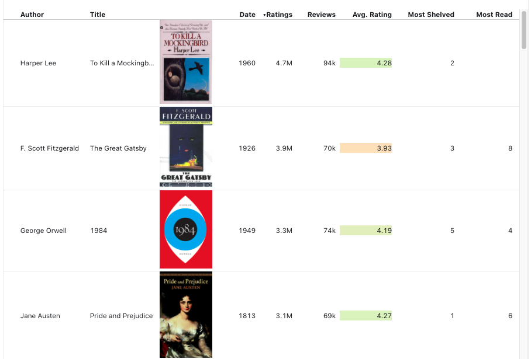
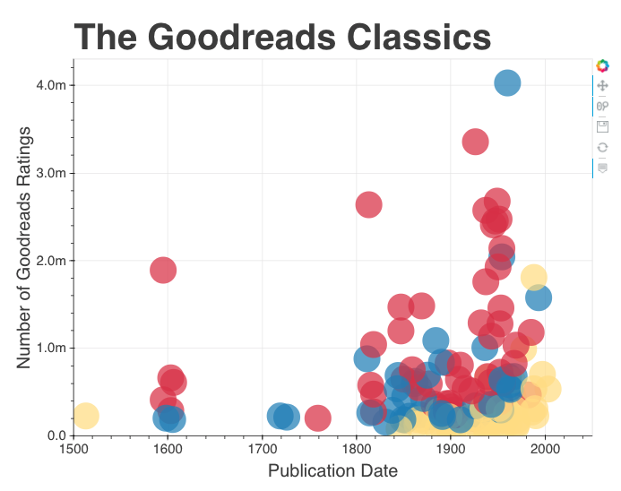
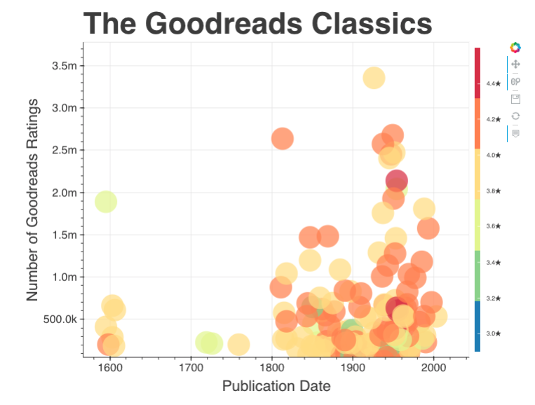
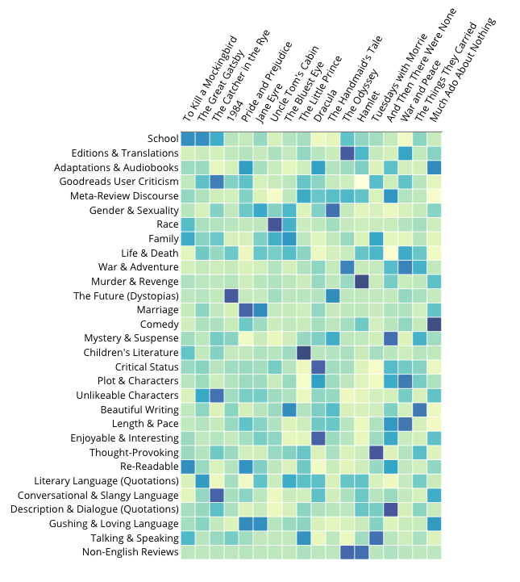

This website hosts data visualizations related to Melanie Walsh and Maria Antoniak's essay, "The Goodreads 'Classics': A Computational Study of Readers, Amazon, and Crowdsourced Amateur Criticism."

## **What books are "classics" according to Goodreads users?**
<figure>

<figcaption> <a href="Goodreads-Classics-Table.html"> Explore a sortable table </a> </figcaption>
</figure>

<figure>

<figcaption> <a href="Goodreads-Classics-Category.html"> Explore a plot of Goodreads ratings vs publication date </a> </figcaption>
</figure>

 

## **Which "classic" books do Goodreads users love and love to hate?**

<figure>

<figcaption> <a href="Goodreads-Classics-Ratings.html"> Explore a plot of Goodreads ratings vs publication date, colored by average Goodreads rating </a> </figcaption>
</figure>

 

## **What do Goodreads users talk about in their reviews of "classic" books?**

<figure>

<figcaption> <a href="Goodreads-Classics-Topics.html"> Explore a heatmap of Goodreads review topic modeling results </a> </figcaption>
</figure>

## **How can I collect Goodreads data for myself?**
  
Check out [Goodreads Scraper](https://github.com/maria-antoniak/goodreads-scraper), Python scripts that we used to collect Goodreads metadata and reviews.

  

